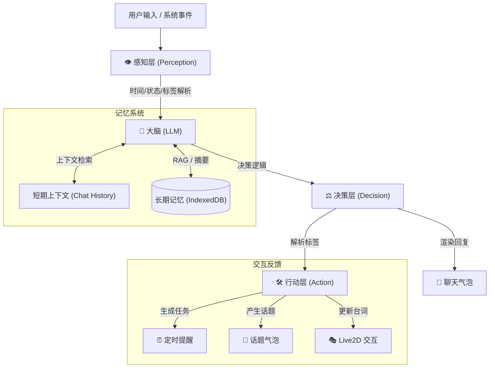

<div align="center">

<h1>Peroperochat — 你的全能 AI 虚拟伙伴</h1>

<p>一个集成了 Live2D 交互、长记忆系统与主动提醒机制的跨平台 AI 智能体项目</p>


<p>
  <b>“不仅仅是聊天机器人，更是能感知时间与任务的虚拟伙伴。”</b>
</p>

</div>

---

📋 **目录 / Table of Contents**

- [🎯 Overview - 项目概述](#-overview---项目概述)
- [🤖 AI Agent - 智能体架构](#-ai-agent---智能体架构)
- [🧠 Memory System - 记忆系统](#-memory-system---记忆系统)
- [🏗️ Architecture - 系统架构与技术栈](#️-architecture---系统架构与技术栈)
- [🚀 Quick Start - 快速开始](#-quick-start---快速开始)
- [📅 Roadmap - 开发计划](#-roadmap---开发计划)
- [⚠️ Disclaimer - 免责声明](#️-disclaimer---免责声明)

---

### 🎯 Overview - 项目概述

**Peroperochat** 是一款专注于沉浸式陪伴的 AI 智能体。它突破了传统 AI “问答式”的局限，引入了**主动交互系统**与**长效记忆机制**。

✨ **核心特色**

- 🎭 **Live2D 深度集成**: 支持模型换装、随机动作、以及根据聊天内容实时更新的交互台词。
- 🫧 **拟物化气泡 UI**: 采用 Glassmorphism（毛玻璃）设计风格，Pero 的回复像吹出的泡泡一样自然漂浮。
- ⏰ **主动提醒系统**: 能够自动识别与主人的约定，生成悬浮任务气泡，并在时间到达时主动发起提醒。
- 🤫 **话题探索机制**: Pero 会在合适的时候产生“想聊的话题”，并以“秘密”气泡的形式悬浮，等待你的探索。
- 📱 **全平台适配**: 基于 Capacitor 构建，支持 Web、Android 与 iOS，真正做到随时随地的陪伴。

---

### 🤖 AI Agent - 智能体架构

Peroperochat 的核心是一个完整的智能体闭环，它不仅在“思考”，更在“感知”与“行动”。



1. **Perception (感知层)**: 系统会自动注入当前时间、用户状态、以及从对话中提取的隐藏标签（如 `<REMINDER>`, `<TOPIC>`）。
2. **Brain (大脑)**: 支持任何兼容 OpenAI 格式的 API。大脑不仅生成文本，还负责规划未来的任务和话题。
3. **Action (行动层)**: 解析特殊的 XML 标签，将其转化为 UI 上的交互元素（如右上角的任务气泡或左上角的话题气泡）。

---

### 🧠 Memory System - 记忆系统

为了解决“聊久就忘”的问题，我们设计了双轨记忆机制：

- **短期记忆**: 维护最近数轮的对话上下文，确保交流的连贯性。
- **长期记忆 (Scribe机制)**: 
  - 使用 **Dexie.js (IndexedDB)** 实现高性能本地存储。
  - 关键信息（爱好、重要事件、约定）会被自动提取并持久化。
  - 支持按需删除，不再强行绑定对话轮次，让记忆更具灵活性。

---

### 🏗️ Architecture - 系统架构与技术栈

项目采用纯前端架构，所有数据存储与逻辑运算均在本地完成，保障隐私与响应速度。

- **核心框架**: [Vue 3](https://vuejs.org/) (Composition API)
- **构建工具**: [Vite](https://vitejs.dev/)
- **UI 组件**: [Element Plus](https://element-plus.org/)
- **数据库**: [Dexie.js](https://dexie.org/) (IndexedDB)
- **移动端跨平台**: [Capacitor](https://capacitorjs.com/)
- **Live2D 引擎**: [Live2D Cubism SDK](https://www.live2d.com/en/)

📁 **项目结构**

```bash
Peroperochat/
├── src/
│   ├── components/      # 核心组件 (Chat, Live2D, History)
│   ├── pages/           # 页面视图 (Home, Settings)
│   ├── api.js           # API 通信与 Prompt 模板管理
│   ├── db.js            # 数据库 Schema 定义
│   └── App.vue          # 应用主入口
├── public/              # 静态资源 (Live2D 模型, 配置文件)
├── capacitor.config.ts  # 移动端打包配置
└── deploy.ps1           # 一键同步部署脚本
```

---

### 🚀 Quick Start - 快速开始

1. **安装依赖**
   ```bash
   npm install
   ```

2. **启动开发环境**
   ```bash
   npm run dev
   ```

3. **打包移动端 (可选)**
   ```bash
   npx cap sync
   npx cap open android # 或 ios
   ```

---

### 📅 Roadmap - 开发计划

- [x] **主动交互系统**: 任务提醒与话题发现。
- [x] **移动端适配**: 完成 Android/iOS 的初步构建支持。
- [ ] **语音交互**: 集成 TTS 与 ASR，实现真正的“对话”。
- [ ] **视觉增强**: 增加更多 Live2D 场景互动与背景切换。
- [ ] **多角色切换**: 支持配置多个不同的 AI 伙伴。

---

### ⚠️ Disclaimer - 免责声明

- 本项目仅供学习交流使用。
- 聊天产生的内容均由第三方大语言模型生成，不代表开发者立场。
- 请遵守相关法律法规，请勿将本项目用于任何非法用途。

---

<div align="center">
  <p>Made with ❤️ by YoKONCy & AI Team</p>
  <p>© 2025 YoKONCy. Licensed under MIT.</p>
</div>
